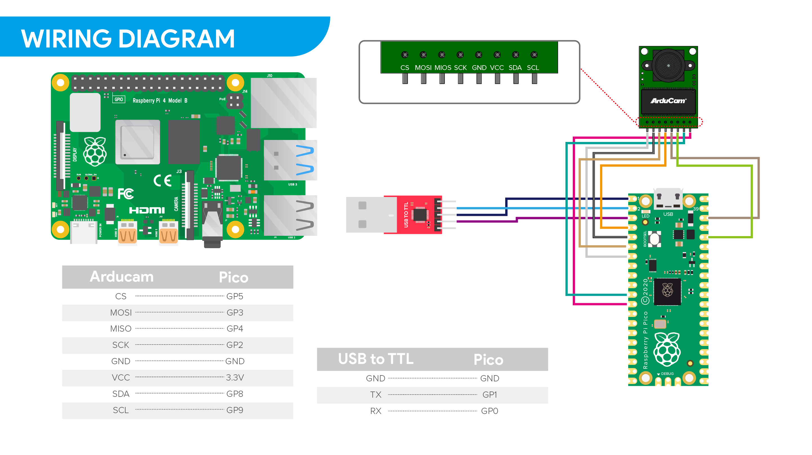

# Code for the Raspberry Pico

The code basis was used from: https://github.com/ArduCAM/PICO_SPI_CAM

The YUV functionality (initialization) was taken from: https://github.com/ArduCAM/RPI-Pico-Cam

## Wiring 

Wiring for the PICO, Arducam, and USB-Serial adapter
(Image source: https://github.com/ArduCAM/RPI-Pico-Cam)

## Preparation

- Press and hold the BOOTSET button on the Pico while plugging the Pico into the PC via USB.
- Then drag the UTF2-File "adafruit-circuitpython-raspberry_pi_pico-de_DE-6.3.0.uf2" onto the Pico. (The needed adafruit and circuitpython packages are then installed)
- Drag all 4 Python files onto the Pico

When the Pico is now powered on the script will run and check for the Arducam.
(make sure the Arducam is wired up before the Pico is powered on)

To power the PICO any method can be used.
These include:
- power via Micro-USB
- 5V power via pin 40 (This can be supplied with the USB-Serial adapter)